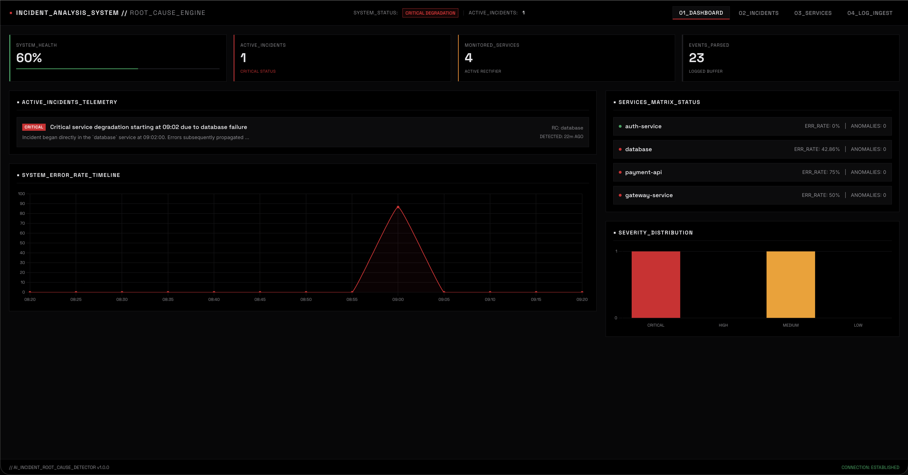
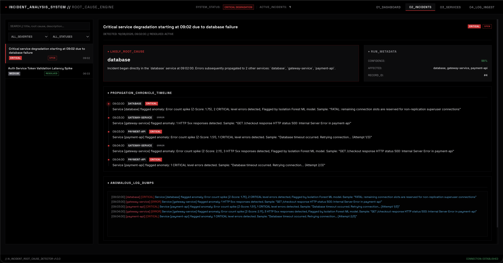
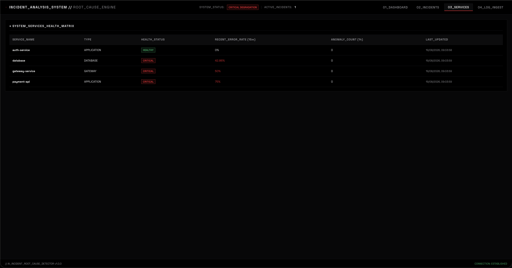

# 🚨 AI Incident & Root-Cause Analyzer

This is a log monitoring and incident analysis project that I built to learn more about backend development, databases, APIs, and how real-world applications handle system failures.

The idea was to build something that can take application or server logs and make them easier to understand. Instead of manually going through hundreds of error messages, the application analyzes the logs, finds unusual activity, groups related errors, and shows what could have caused the incident.

While working on this project, I learned how to connect a Python backend with a JavaScript frontend, work with PostgreSQL, build REST APIs using FastAPI, process log data, and use basic machine learning techniques for anomaly detection.

---

## Features

* Upload and analyze application logs
* Detect errors, warnings, timeouts, and HTTP failures
* Identify unusual spikes in error activity
* Group similar errors together
* Detect and track incidents
* Show affected services
* Estimate the most likely root cause
* Display incident timelines
* Monitor service health
* View previous incidents
* Filter incidents by severity and status
* View system analytics through charts
* Store logs and incidents using PostgreSQL

---

## Built With

* HTML
* CSS
* JavaScript
* Python
* FastAPI
* PostgreSQL
* SQLAlchemy
* Pandas
* NumPy
* Scikit-learn
* Chart.js

---

## Project Screenshots

### Dashboard

### Incident Analysis

### Service Health

---

## What I Learned

Some of the things I learned while building this project:

* Building REST APIs using FastAPI
* Connecting Python applications with PostgreSQL
* Working with SQLAlchemy and database relationships
* Processing and analyzing application logs
* Detecting unusual patterns in data
* Using basic machine learning techniques
* Connecting JavaScript with backend APIs
* Building interactive charts
* Structuring a full-stack project
* Managing projects using Git and GitHub

---

## Future Improvements

There are still a few things I would like to add:

* Real-time log monitoring
* Live system health updates
* Better anomaly detection
* AI-based incident explanations
* Automated troubleshooting suggestions
* User authentication
* Docker support
* Cloud deployment

---

## About

This project helped me understand how frontend, backend, databases, and data analysis can work together in one application.

It was also a good opportunity for me to move beyond simple dashboards and build something closer to a real-world software monitoring system.

---

## Live Demo

🔗 Coming Soon

---

## Author

**Kaushal**

Building projects and learning Python, Data Analytics, Backend Development, and AI along the way.
